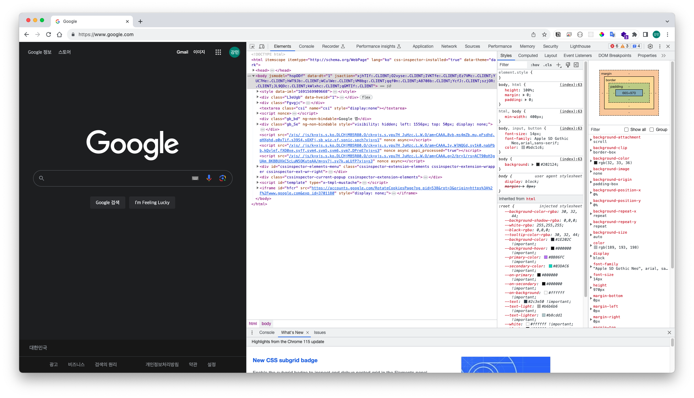
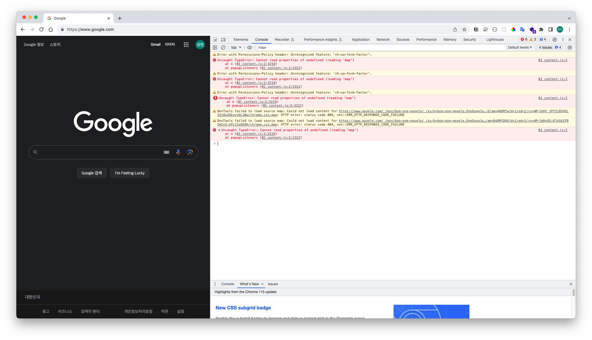
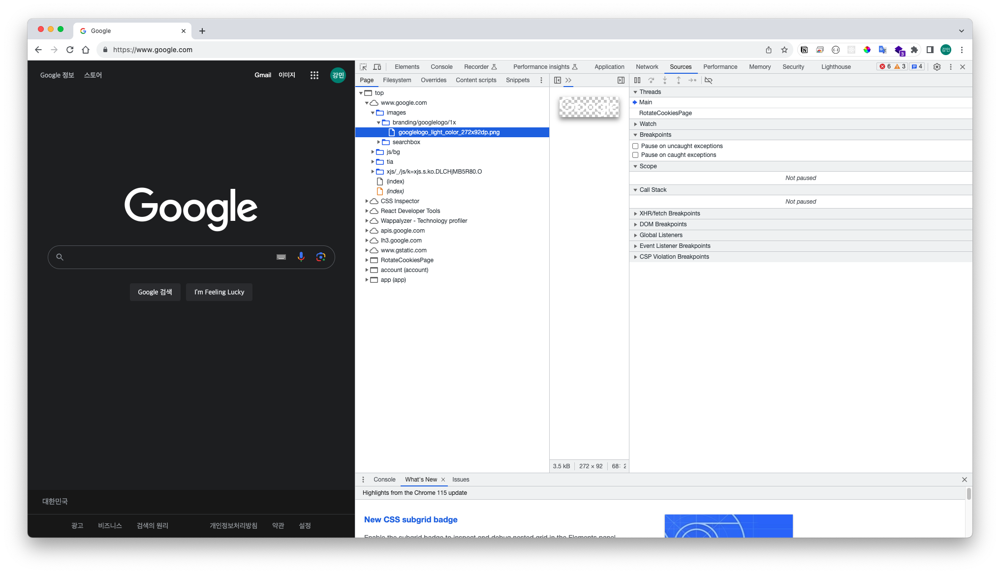
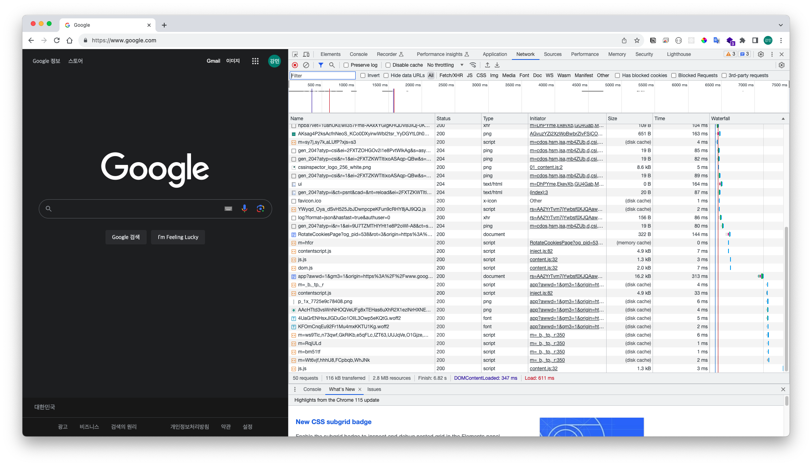
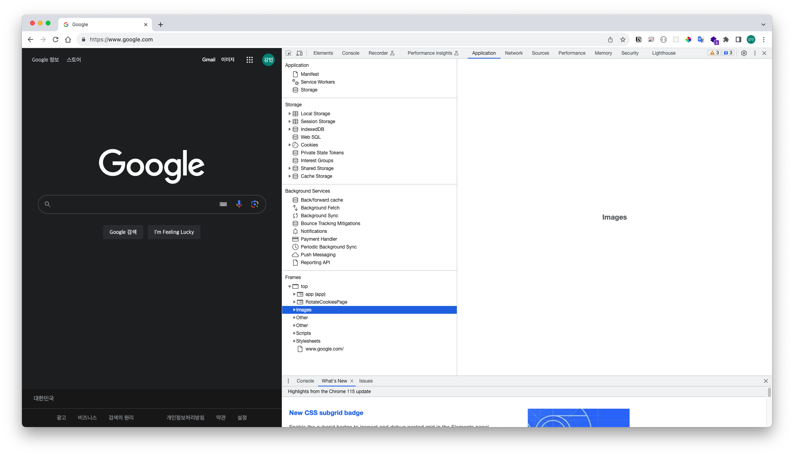
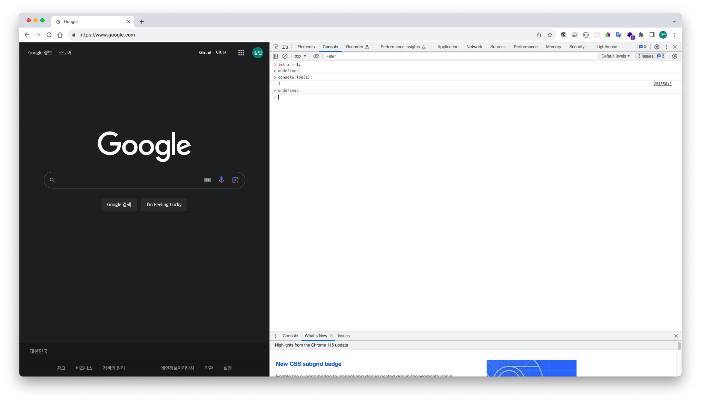
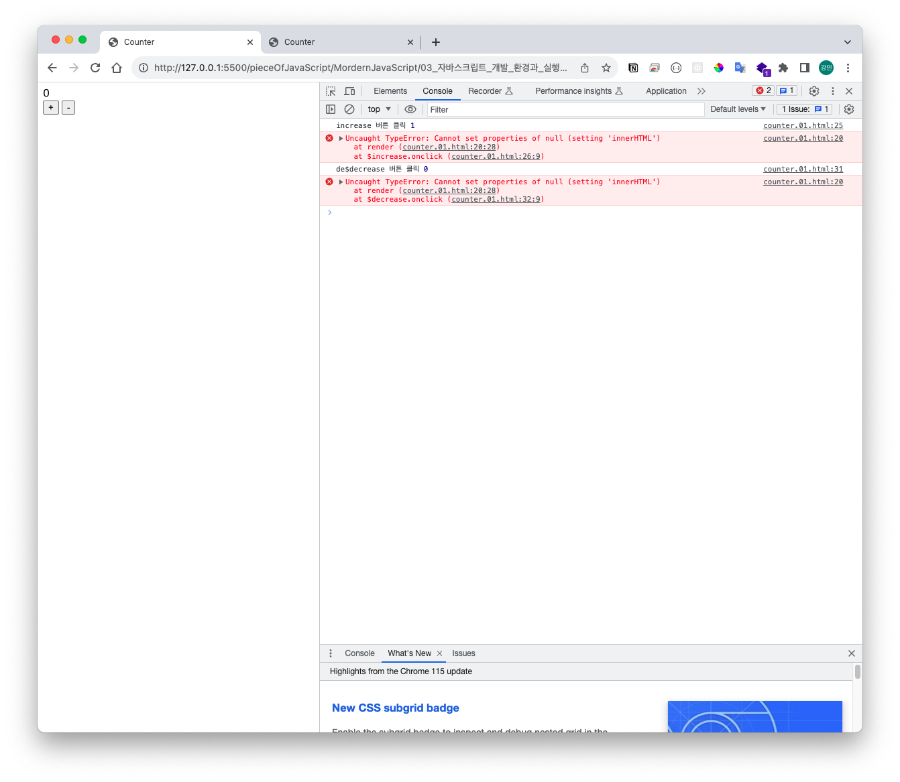
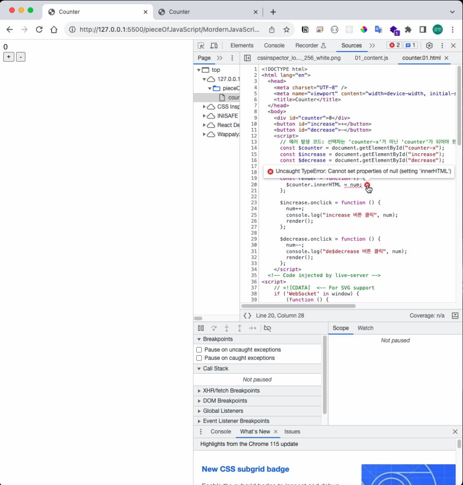
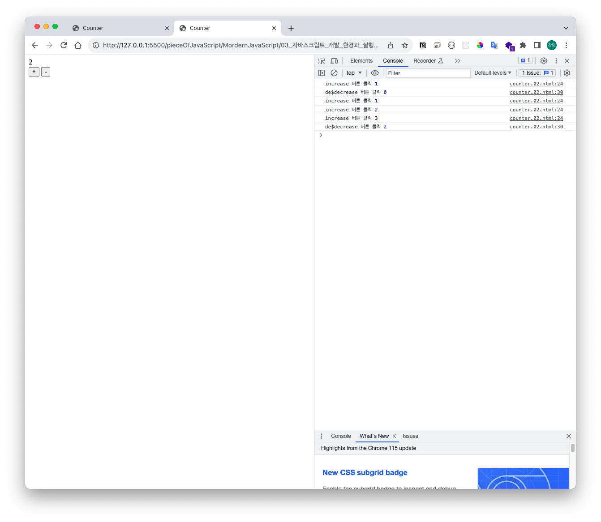

# 03. 자바스크립트 개발 환경과 실행 방법

## 3.1 자바스크립트 실행 환경

- JavaScript 실행환경: 브라우저 & Node.js

### 공통점

- ECMAScript 실행 가능

### 차이점

#### 주 목적

- 브라우저: HTML, CSS, JavaScript를 실행해 웹페이지를 브라우저 화면에 렌더링하는 것이 주 목적이다.
- Node.js 브라우저 외부에서 자바스크립트 실행 환경을 제공하는 것이 주 목적이다.

#### ECMAScript 이외에 추가로 제공하는 기능은 호환되지 않는다

- 브라우저는 파싱된 HTML 요소를 선택하거나 조작하는 기능의 집합인 DOM API를 기본적으로 제공한다.
- Node.js에서는 DOM을 직접 조작할 필요가 없기 때문에 DOM API를 제공하지 않는다.

#### 파일 시스템

- Node.js에서는 파일을 생성하고 수정할 수 있다.
- 브라우저는 파일 시스템을 지원하지 않는다. (Web API인 FileReader 객체를 사용해 사용자가 지정한 파일을 읽어 들이는 것은 가능)

</br>

> 클라이언트 사이드 Web API (브라우저에서 지원)
>
> ECMAScript, DOM, BOM, Canvas, XMLHttpRequest, fetch, requestAnimationFrame, SVG, Web Storage, Web Component, Web Worker

</br>

> Node.js API (Node.js에서 지원하는 API)
>
> <https://nodejs.org/ko/docs>

## 3.2 Web Browser

- 점유율이 가장 높은 구글 크롬 사용
- 크롬 설치: <https://www.google.com/intl/ko_kr/chrome/>

### 3.2.1 개발자 도구(DevTools)

#### 개발자 도구 여는 방법

- 공통: 툴바의 주소 검색창 우측 토글 버튼(≡) - 도구 더보기 - 개발자 도구
- 윈도우: F12 또는 Ctrl+Shift+I
- macOS: command + option + I

#### 개발자 도구가 제공하는 기능

##### Elements

- 로딩된 웹페이지의 DOM과 CSS를 편집해서 렌더링된 뷰를 확인할 수 있다.(**단, 편집한 내용이 저장되지 않는다**)



##### Console

- 로딩된 웹페이지의 에러를 확인하거나 자바스크립트 소스코드에 작성한 <code style="color:#db0202; background-color:#d1cfcf; padding:4px;">console.log</code> 메서드의 실행 결과를 확인할 수 있다.



- 콘솔에 대한 내용은 아래의 [# 3.2.2 Console](#322-console) 에서 추가 정리한다.

##### Sources

- 로딩된 웹페이지의 자바스크립트 코드를 디버깅할 수 있다.



##### Network

- 로딩된 웹페이지에 관련된 네트워크 요청(Request) 정보와 성능을 확인할 수 있다.



##### Application

- 웹 스토리지, 세션, 쿠키를 확인하고 관리할 수 있다.



### 3.2.2 Console

- 에러 발생 확인에 용이하다.
- 애플리케이션 구현 과정 중 콘솔을 열어둔 채로 개발하는 것이 안정적이다.
  - 인지 하지 못한 오류도 확인 가능하다.
  - 디버깅을 실행 하기도 하지만, <code style="color:#db0202; background-color:#d1cfcf; padding:4px;">console.log</code> 를 이용해 코드의 실행 결과를 확인하며 개발을 진행하기도 한다.
- 자바스크립트를 직접 입력해 그 결과를 확인할 수 있는 **REPL(Read Eval Print Loop: 입력 수행 출력 반복)** 환경으로 사용할 수 도 있다.



> Chrome Console 상세 기술 참고: <https://developer.chrome.com/docs/devtools/console/>

### 3.2.3 브라우저에서 자바스크립트 실행 & 3.2.4 디버깅

- 브라우저는 HTML 파일을 로드하면 script 태그에 포함된 자바스크립트 코드를 실행한다. 만약 자바스크립트 코드 내에서 console.log 메서드가 호출되었다면 콘솔에 실행 결과가 출력된다.

#### 브라우저의 자바스크립트 실행 및 오류 출력, 디버깅

- 오류가 있는 HTML 코드

```html
<!DOCTYPE html>
<html lang="en">
  <head>
    <meta charset="UTF-8" />
    <meta name="viewport" content="width=device-width, initial-scale=1.0" />
    <title>Counter</title>
  </head>
  <body>
    <div id="counter">0</div>
    <button id="increase">+</button>
    <button id="decrease">-</button>
    <script>
      // 에러 발생 코드: 선택자는 'counter-x'가 아닌 'counter'가 되어야 한다.
      const $counter = document.getElementById("counter-x");
      const $increase = document.getElementById("increase");
      const $decrease = document.getElementById("decrease");

      let num = 0;
      const render = function () {
        $counter.innerHTML = num;
      };

      $increase.onclick = function () {
        num++;
        console.log("increase 버튼 클릭", num);
        render();
      };

      $decrease.onclick = function () {
        num--;
        console.log("de$decrease 버튼 클릭", num);
        render();
      };
    </script>
  </body>
</html>
```

파일 확인: [counter.01.html](./code/counter.01.html)





- 오류를 수정한 HTML 코드

```html
<!DOCTYPE html>
<html lang="en">
  <head>
    <meta charset="UTF-8" />
    <meta name="viewport" content="width=device-width, initial-scale=1.0" />
    <title>Counter</title>
  </head>
  <body>
    <div id="counter">0</div>
    <button id="increase">+</button>
    <button id="decrease">-</button>
    <script>
      const $counter = document.getElementById("counter");
      const $increase = document.getElementById("increase");
      const $decrease = document.getElementById("decrease");

      let num = 0;
      const render = function () {
        $counter.innerHTML = num;
      };

      $increase.onclick = function () {
        num++;
        console.log("increase 버튼 클릭", num);
        render();
      };

      $decrease.onclick = function () {
        num--;
        console.log("de$decrease 버튼 클릭", num);
        render();
      };
    </script>
  </body>
</html>
```

파일 확인: [counter.02.html](./code/counter.02.html)



## 3.3 Node.js

- 규모가 큰 개발을 하는 경우 React, Angular, Vue.js 같은 프레임워크 또는 라이브러리를 도입하거나 Babel, Webpack, ESLint 등 여러가지 도구를 사용할 필요가 있을 때 Node.js와 npm을 이용한다.

### 3.3.1 Node.js와 npm

- **Node.js**: 자바스크립트 런타임.(자바스크립트 실행 환경)
- **npm**: 자바스크립트 패키지 매니저. Node.js에서 사용할 수 있는 **모듈들을 패키지화해서 모아둔 저장소** 역할과 **패키지 설치 및 관리를 위한 CLI(Command Line Interface)를 제공**한다.

### 3.3.2 Node.js 설치

- 설치: <https://nodejs.org/ko/download>

  - 본인 PC에 맞는 Node.js 설치

- 설치 완료 후 터미널을 열어 다음을 입력해 Node.js의 버전과 npm 버전 확인. (설치한 버전에 따라 달라질 수 있다)

  ```shell
  $ node -v
  v18.15.0
  $ npm -v
  9.5.0
  ```

### 3.3.3 Node.js REPL

- Node.js가 제공하는 REPL을 사용하기 위해 다음을 터미널에 입력

  ```shell
  $ node
  Welcome to Node.js v18.15.0.
  Type ".help" for more information.
  >
  ```

- 프롬프트 시작시 다음과 같이 자바스크립트 코드 실행 가능

  ```shell
  Welcome to Node.js v18.15.0.
  Type ".help" for more information.
  > 1+2
  3
  > Math.max(1,2,3)
  3
  > [ 1, 2, 3].filter(v => v % 2);
  [ 1, 3 ]
  ```

- 프롬프트 종료

  ```shell
  $ node
  Welcome to Node.js v18.15.0.
  Type ".help" for more information.
  > .exit # REPL 종료
  # 또는 키보드의 ctrl + c 두번 입력
  (To exit, press Ctrl+C again or Ctrl+D or type .exit)
  >
  ```

- 자바스크립트 파일 실행: 파일 이름 입력(.js는 생략 가능)

  ```shell
  $ node index.js
  # Output
  ```

## 3.4 Visual Studio Code(:VSCode, 비주얼 스튜디오 코드)

### 3.4.1 비주얼 스튜디오 코드 설치

-
