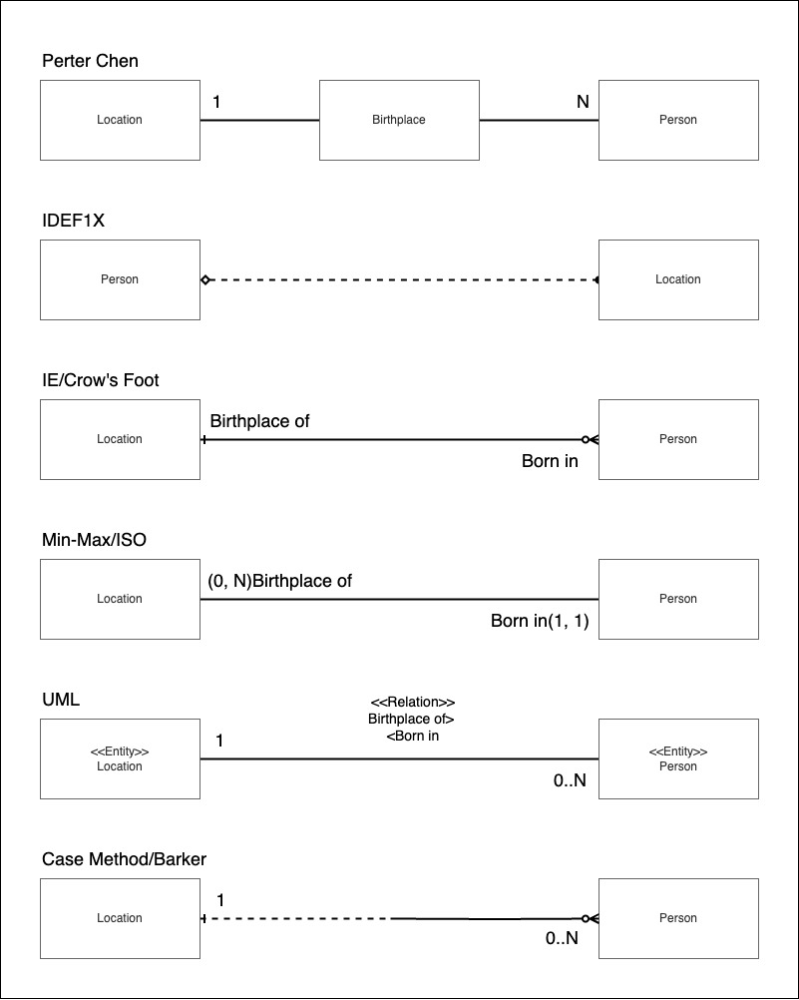
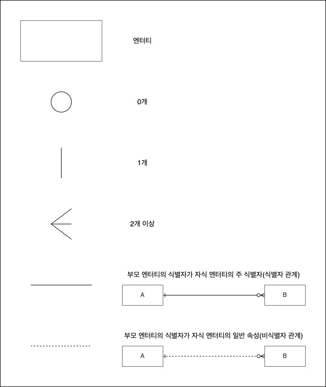

#SQLD #database #data-modeling

# 데이터 모델의 이해

## 모델링

- 현실 세계를 단순화하여 표현하는 기법

## 모델링의 특징

### 추상화(Abstraction)

- 현실 세계를 일정한 형식으로 표현하는 것
- 아이디어나 개념을 간략하게 표현하는 과정

### 단순화(Simplification)

- 복잡한 현실 세계를 정해진 표기법으로 단순하고 쉽게 표현

### 명확화(Clarity)

- 불분명함을 제거하고 명확하게 해석할 수 있도록 기술

> 데이터 베이스의 모델링은 현실세계를 추상화, 단순화 명확화하기 위해 일정한 표기법에 의해 표현하는 기법이다.

## 모델링의 세 가지 관점

### 데이터 관점(What, Data)

- 데이터 위주의 모델링
- 어떤 데이터들이 업무와 얽혀있는지, 그리고 데이터 간에는 어떤 관계가 있는지에 대한 모델링

### 프로세스 관점(How, Process)

- 프로세스 위주의 모델링
- 업무가 실제로 처리하고 있는 일은 무엇이며, 앞으로 처리해야 하는 일은 무엇인지에 대한 모델링

### 데이터와 프로세스의 상관 관점(Data vs. Process, Interaction)

- 데이터와 프로세스의 관계 위주의 모델링
- 프로세스의 흐름에 따라 데이터가 어떤 영향을 받는지를 모델링하는 방법

## 모델링의 세 가지 단계

### 개념적 데이터 모델링(Conceptual Data Modeling)

- 데이터 모델링 수행 시 행해지며, 추상화 레벨이 가장 높은 모델링이다.
- 업무 중심 적이고 포괄적인 수준의 모델링이 진행

### 논리적 데이터 모델링(Logical Data Modeling)

- 재사용성이 가장 높은 모델링
- 데이터베이스 모델에 대한 Key, 속성, 관계 등을 모두 표현하는 단계

### 물리적 데이터 모델링(Physical Data Modeling)

- 실제 데이터베이스로 구현을 가정
- 성능이나 가용성 등의 물리적인 성격을 고려하여 모델을 표현하는 단계

## 데이터의 독립성

ANSI-SPARC(American National Standards Institute, Standards Planning and Requirements Committee) 아키텍처 : 추상적인 설계 표준. 스키마를 3단계로 나눈다.

### 3단계 스키마 구조

#### 외부 스키마(External Schema)

- 사용자의 관점, Multiple User's View
- 각 사용자가 보는 데이터베이스의 스키마를 정의한다.

#### 개념 스키마(Conceptual Schema)

- 통합된 관점, Community View of DB
- 모든 사용자가 보는 데이터베이스의 스키마를 통합하여 전체 데이터베이스를 나타내는 것
- 데이터베이스에 저장된는 데이터들을 표현하고 데이터들 간의 관계를 나타낸다.

#### 내부 스키마(Internal Schema)

- 물리적인 관점, Physical Representation
- 데이터의 저장 구조나 [컬럼(Column)](../../02_SQL_기본_및_활용/테이블/컬럼(Column).md) 정의, 인덱스 등이 포함된다.

### 3단계 스키마 구조가 보장하는 독립성

ANSI-SPARC 아키텍처에서 스키마를 3단계 구조로 나누는 이유는 데이터 베이스에 대한 사용자들의 관점과 데이터베이스가 실제로 표현되는 물리적인 방식을 분리하여 독립성을 보장하기 위한 것.

#### 논리적인 독립성

- 개념 스키마가 변경되어도 외부 스키마는 영향 받지 않는다

#### 물리적인 독립성

- 내부 스키마가 변경되어도 외부/개념 스키마는 영향 받지 않는다.

## ERD(Entity Relation Diagram)

- 시스템 사이에 어떤 엔터티들이 존재하며, 엔터티 간에 어떤 관계가 있는지를 나타내는 다이어 그램이다.

### ERD 표기 방식

- Peter Chen: 주로 대학교재에서 사용하는 표기법으로, 실무에서 사용하는 경우는 드물다
- IDEF1X (Integration Definition for Information Modeling): 실무에서 사용하는 경우도 있으며 ERWin 에서 사용하는 모델.
- IE/Crow's Foot: 까마귀발 표기법. 가장 많이 사용한다. ERWin, ERStudio에서 사용하는 모델
- Min-Max/ISO: 각 엔터티의 참여도를 좀 더 상세하게 나타내는 표기법
- UML: 소프트웨어 공학에서 주로 사용되는 모델
- Case Method/Barker: Oracle에서 사용되는 모델로 Crow's Foot과 비슷하다.

### IE/Crow's Foot 표기법

### ERD 작성 순서

어떤 표기법을 사용하던, ERD 작성 순서는 공통된 사항이다.

1. 엔터티를 도출하고 그린다.
2. 엔터티를 적절하게 배치한다.
3. 엔터티 간의 관계를 설정한다.
4. 관계명을 기입한다.
5. 관계의 참여도를 기입한다.
6. 관계의 필수/선택 여부를 기입한다.
