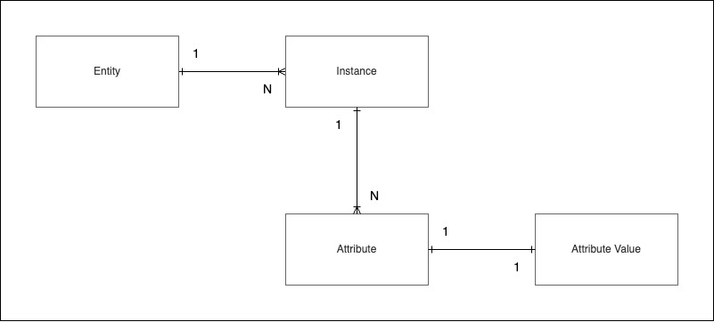

#SQLD  #database #data-modeling #attribute

# 속성(Attribute)

- [[엔터티(Entity)]]의 특징을 설명해줄 수 있는 항목들
- 의마상 더이상 쪼개지지 않는 레벨
- 프로세스에 필요한 항목이어야 한다.

## 속성값(Attribute Value)

- 속성이 갖는 값
- 엔터티에 속한 하나의 인스턴스를 구체적으로 나타내주는 데이터

## 엔터티, 인스턴스, 속성, 속성값의 관계

 

- 한 개의 엔터티는 두 개 이상의 인스턴스를 갖는다
- 한 개의 인스턴스는 두 개 이상의 속성을 갖는다
- 한 개의 속성은 하나의 속성 값을 갖는다

## 분류

### 특성에 따른 분류

#### 기본 속성(Basic Attribute)

- 업무 프로세스를 통해 바로 정의 가능한 속성
- 설계 속성과 파생 속성을 제외한 모든 속성

#### 설계 속성(Designed Attribute)

- 업무에 존재하지 않지만, 설계 중 필요에 의해 추가된 속성

#### 파생 속성(Derived Attribute)

- 다른 속성의 속성 값을 계산하거나 특정한 규칙으로 변형하여 생성한 속성

### 구성 방식에 따른 분류

#### PK(Primary Key) 속성

- 엔터티의 인스턴스들을 식별할 수 있는 속성
- 인스턴스에 유니크함을 부여하는 속성이다.

#### FK(Foreign Key) 속성

- 다른 엔터티의 속성에서 가져온 속성
- 다른 엔터티와 관계를 맺게 해주는 속성이다.

#### 일반 속성

- PK, FK를 제외한 나머지 속성

## 도메인(Domain)

- 속성이 가질 수 있는 속성 값의 범위
