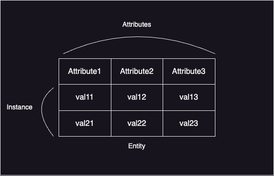

#SQLD  #database #data-modeling #entity

# 엔터티(Entity)

- 식별이 가능한 객체
- 업무에서 쓰이는 데이터를 용도별로 분류한 그룹
- RDB에서 테이블에 해당한다.
- [속성(Attribute)](속성(Attribute).md)를 갖는다. 속성을 통해 자신을 상세히 설명한다.

## 엔터티의 특징

- 업무에서 쓰이는 정보여야 한다.
- 유니크함을 보장할 수 있는 [식별자(Identifier)](식별자(Identifier).md)가 있어야한다.
  - [인스턴스(Instance)](인스턴스(Instance).md)가 중복되거나 식별이 모호하면 엔터티 설계가 잘못된 것이다.
- 2개 이상의 인스턴스(Instance)를 가지고 있어야한다.
- 반드시 속성을 가지고 있어야한다.
- 다른 엔터티와 1개 이상의 관계를 가지고 있어야한다.

## 엔터티의 분류

### 유형 vs 무형

#### 유형 엔터티

- 물리적인 형태의 존재
- 안정적, 지속적
- ex) 상품, 회원

#### 개념 엔터티

- 물리적인 형태 없음
- 개념적
- ex) 부서, 학과

#### 사건 엔터티

- 행위를 함으로써 발생
- 통계 자료로 이용 가능
- ex) 주문, 이벤트 응모

### 발생 시점

#### 기본 엔터티

- 독립적으로 생성된다
- 자식 엔터티를 가질 수 있다.
- ex) 상품, 회원

#### 중심 엔터티

- 기본 엔터티로부터 파생된다
- 행위 엔터티 생성
- ex) 주문

#### 행위 엔터티

- 2개 이상의 엔터티로부터 파생된다.
- ex)주문 내역, 이벤트 응모 이력

## 엔티티 명명 규칙

- 업무에서 실제로 쓰이는 용어 사용
- 한글은 약어를 사용하지 않고 영문은 대문자 표기
- 단수 명사로 표현하고, 띄어쓰기는 하지 않는다
- 다른 엔터티와 의미상으로 중복될 수 없다
- 해당 엔터티가 갖고 있는 데이터가 무엇인지 명확하게 표현한다
