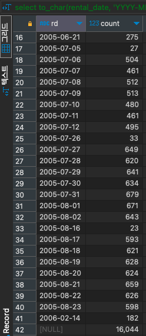
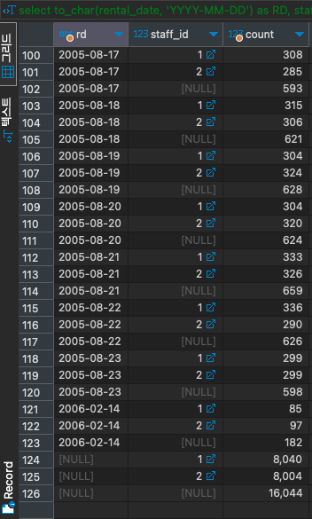

# CUBE

#SQLD #SQL #group-function 

소그룹 간의 소계 및 총계를 다차원적으로 계산할 수 있는 함수이다.

[GROUP_BY](../../GROUP_BY.md) 가 일방향 그룹핑으로 소계를 구한 반면, CUBE는 조합할 수 있는 모든 그룹에 대한 소계를 집계한다.

## CUBE(COLUMN)

- COLUMN로 그룹핑
- 총 합계

[ROLLUP](../ROLLUP/ROLLUP.md)(COLUMN) 와 같다.

```SQL
SELECT to_char(rental_date, 'YYYY-MM-DD') AS RD, COUNT(*)
FROM rental
GROUP BY CUBE(RD)
ORDER BY RD;
```



## CUBE(COLUMN1, COLUMN2)

- COLUMN1과 COLUMN2로 그룹핑
- COLUMN1로 그룹핑
- COULMN2로 그룹핑
- 총 합계

```SQL
SELECT to_char(rental_date, 'YYYY-MM-DD') AS RD, staff_id, COUNT(*)
FROM rental
GROUP BY CUBE(RD, staff_id)
ORDER BY RD, staff_id;
```



## CUBE(COLUMN1, COLUMN2, COLUMN3)

- COLUMN1과 COLUMN2, COLUMN3로 그룹핑
- COLUMN1과 COLUMN2로 그룹핑
- COLUMN1과 COLUMN3로 그룹핑
- COLUMN2와 COLUMN3로 그룹핑
- COLUMN1로 그룹핑
- COULMN2로 그룹핑
- COLUMN3로 그룹핑
- 총 합계

```SQL
SELECT to_char(rental_date, 'YYYY-MM-DD') AS RD, staff_id, customer_id, COUNT(*)
FROM rental
GROUP BY CUBE(RD, staff_id, customer_id)
ORDER BY RD, staff_id, customer_id;
```
