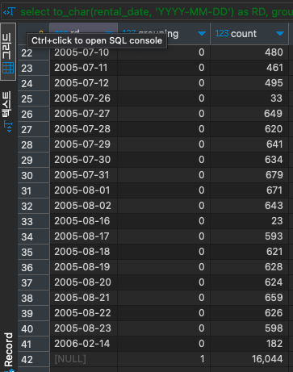

# GROUPING

#SQL #SQLD #group-function 

[ROLLUP](../ROLLUP/ROLLUP.md) , [CUBE](../CUBE/CUBE.md) , [GROUPING_SETS](../GROUPING_SETS/GROUPING_SETS.md) 등과 함께 쓰이며 소계를 나타내는 Row를 구분할 수 있게 해준다.

```SQL
select to_char(rental_date, 'YYYY-MM-DD') as RD, grouping(to_char(rental_date, 'YYYY-MM-DD')), count(*)
from rental r
group by ROLLUP(RD)
order by RD;
```


