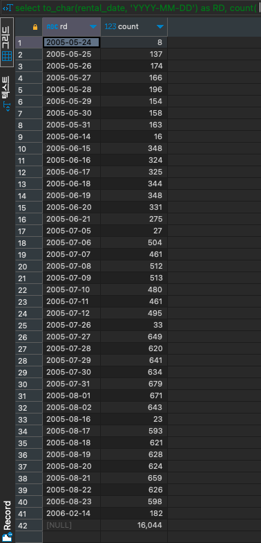

# ROLLUP

#SQLD #SQL #group-function 

소그룹 간의 소계 및 총계를 계산하는 함수

## Sample DB


## ROLLUP(COLUMN)

- `COLUMN` 으로 그룹핑
- 총합계

위 두 단계의 항목을 반환 한다.

```SQL
SELECT to_char(rental_date, 'YYYY-MM-DD') AS RD, COUNT(*)
FROM rental r
GROUP BY ROLLUP(RD)
ORDER BY RD;
```




## ROLLUP(COLUMN1, COLUMN2)

- `COLUMN1`, `COLUMN2` 로 그룹핑
- `COLUMN1` 으로 그룹핑
- 총합계

위 3단계의 항목을 반환한다.

```SQL
select to_char(rental_date, 'YYYY-MM-DD') as RD, staff_id , count(*)
from rental r
group by ROLLUP(RD, staff_id)
order by RD, staff_id ;
```


## ROLLUP(COLUMN1, COLUMN2, COLUMN3)

- COLUMN1, COLUMN2, COLUMN3 로 그룹핑
- COLUMN1, COLUMN2 로 그룹핑
- COLUMN1 로 그룹핑
- 총합계

위 4단계의 결과를 반환합니다.
괄호를 이용해 두 개의 컬럼을 묶어서 그룹핑 할 수 있습니다.
