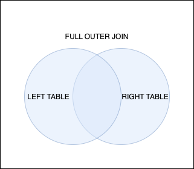

# FULL OUTER JOIN

#SQLD #SQL #join 

왼쪽과 오른쪽 테이블의 데이터가 모두 출력되는 방식의 JOIN 쿼리이다. [LEFT_OUTER_JOIN](LEFT_OUTER_JOIN.md)과 [RIGHT_OUTER_JOIN](RIGHT_OUTER_JOIN.md)의 합집합으로 보면 되며, 중복되는 데이터들은 제외된다.



## 문법

```SQL
SELECT A.COL1, B.COL2, ...
FROM A
	FULL OUTER JOIN B ON A.COL1 = B.COL2;
```

- A와 B의 모든 데이터가 출력되며, 중복되는 데이터는 제외된다.
