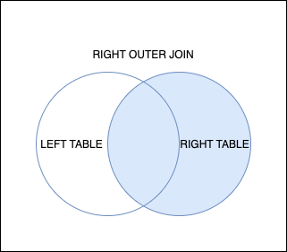

# RIGHT OUTER JOIN

#SQLD #SQL #join 

SQL에서 오른쪽에 표기된 테이블의 데이터는 무조건 출력되는 JOIN 쿼리이다. 왼쪽 테이블에 존재하지 않는 데이터는 모두 NULL 처리된다.



## 문법

```SQL
SELECT A.Col1, B.Col2, ...
FROM A
	RIGHT OUTER JOIN B ON A.COL1 = B.COL1;
```

- B에 있는 모든 데이터가 출력되며, 존재하지 않는 A의 데이터는 모두 NULL 처리 된다.

## 예시

```SQL
SELECT P.PRODUCT_CODE,
		P.PRODUCT_NAME,
		P.PRODUCT_PRICE,
		PR.MEMBER_ID,
		PR.TITLE,
		PR.CONTENTS
FROM PRODUCT P
	RIGHT OUTER JOIN PRODUCT REVIEW PR 
		ON P.PRODUCT_CODE = PR.PRODUCT_CODE;
```