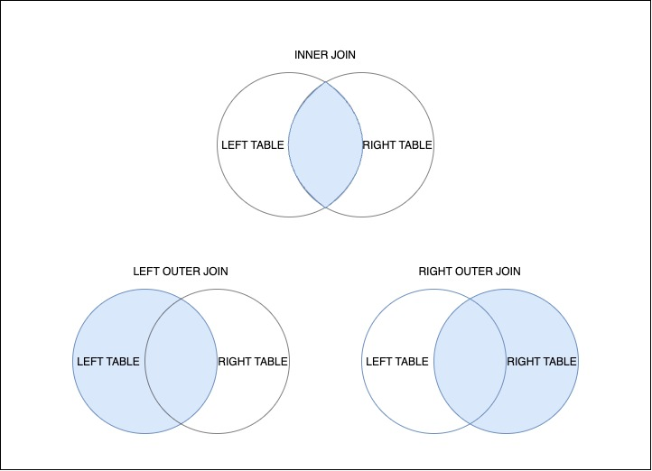

# STANDART JOIN

#SQLD #SQL #join

여러 RDBMS들에서 표준이되는 ANSI SQL 중 하나로, MySQL / ORACLE / PostgreSQL 등 여러 RDBMS에서 동작하는 [JOIN](JOIN.md) 쿼리이다.

- 표준 조인, ANSI JOIN이라는 말로 많이 불린다.

## STANDARD JOIN 종류

### [INNER_JOIN](INNER_JOIN.md)

### [OUTER_JOIN](OUTER_JOIN.md)

### INNER JOIN 과 OUTER JOIN 벤다이어그램

### [NATURAL_JOIN](NATURAL_JOIN.md)

### [CROSS_JOIN](CROSS_JOIN.md)
