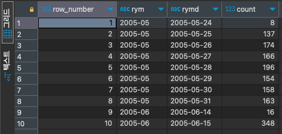

# 💡 TOP-N 쿼리

가장 상위에서 부터 N개의 데이터를 추출하겠다는 의미이다.

## 📌 ORACLE

Oracle에는 ROWNUM 슈도 컬럼(Psuedo Column)이다. 즉, 실제로는 존재하지 않는 가짜 컬럼이다.
이는 임의로 매겨진 번호이기 때문에 WHERE절을 이용해 추출한다면, 랜덤한 데이터를 추출하게 된다.

서브쿼리를 이용해 추출한다면 특정 조건으로 정렬한 뒤 번호를 매길 수 있다.

## 📌 PostgreSQL

PostgreSQL에는 ROWNUM이라는 가상 컬럼이 없이 없기 때문에 [ROW_NUMBER](../윈도우_함수/순위_함수/ROW_NUMBER.md) 함수를 사용해 쿼리를 구성했다. 이 외에도 [윈도우_함수](../윈도우_함수/윈도우_함수.md)의 순위 함수를 이용할 수 있다.

윈도우 함수와 WHERE를 함께 이용한다면 원하는 순위를 매겨서 번호를 매길 수 있다.

```SQL
select *
from (
 select row_number() over(order by to_char(rental_date, 'YYYY-MM')) as row_number,
     to_char(rental_date, 'YYYY-MM') as RYM,
     to_char(rental_date, 'YYYY-MM-DD') as RYMD,
     count(*)
 from rental r
 group by RYM, RYMD
) t
where t.row_number <= 10;
```


