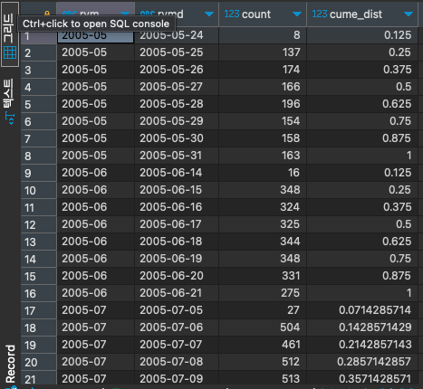

# CUME_DIST

#SQL #SQLD #window-function 

해당 파티션에서의 누적 백분율을 구하는 함수이다. 결과값은 0보다 크고 1보다 작거나 같은 값을 가진다.

```SQL
select t.rym, t.rymd, t.count,
	   cume_dist () over(partition by t.rym order by t.rymd)
from (
	select to_char(rental_date, 'YYYY-MM') as RYM,
		   to_char(rental_date, 'YYYY-MM-DD') as RYMD,
		   count(*)
	from rental r
	group by RYM, RYMD
) t;
```


