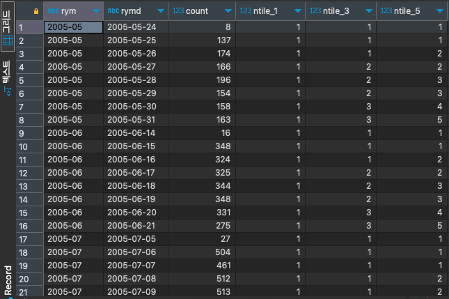

# NTILE

#SQL #SQLD #window-function 

주어진 수만큼 행들을 n등분한 후 현재 행에 해당하는 등급을 구하는 함수이다.

- 주어진 수 만큼 채우고도, 할당할 행이 남아있다면 맨 앞의 그룹부터 하나씩 더 채워 나간다.

```SQL
select t.rym, t.rymd, t.count,
	   NTILE(1) over(partition by t.rym order by t.rymd),
	   NTILE(3) over(partition by t.rym order by t.rymd),
	   NTILE(5) over(partition by t.rym order by t.rymd)
from (
	select to_char(rental_date, 'YYYY-MM') as RYM,
		   to_char(rental_date, 'YYYY-MM-DD') as RYMD,
		   count(*)
	from rental r
	group by RYM, RYMD
) t;
```


