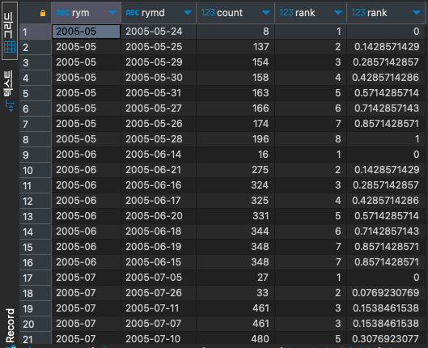

# PERCENT_RANK

#SQL #SQLD #window-function 

파티션의 맨 위 끝 행을 0, 맨 아래 끝 행을 1로 놓고 현재 행이 위치하는 백분위 순위 값을 구하는 함수이다.

```SQL
select t.rym, t.rymd, t.count,
	   RANK() over(partition by t.rym order by t.count) as rank,
	   percent_rank() over(partition by t.rym order by t.count) as rank
from (
	select to_char(rental_date, 'YYYY-MM') as RYM,
		   to_char(rental_date, 'YYYY-MM-DD') as RYMD,
		   count(*)
	from rental r
	group by RYM, RYMD
) t;
```


