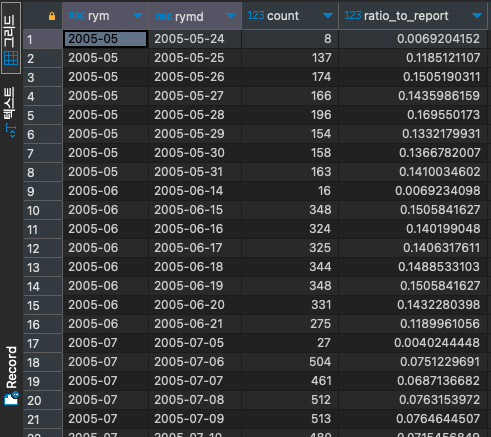

# RATIO_TO_REPORT

#SQL #SQLD #window-function

파티션 별 합계에서 차지하는 비율을 구하는 함수이다.

```SQL
select to_char(rental_date, 'YYYY-MM') as RYM,
	   to_char(rental_date, 'YYYY-MM-DD') as RYMD,
	   count(*),
	   1.0 * count(*) / NULLIF(SUM(count(*)) over(
	   					partition by to_char(rental_date, 'YYYY-MM')
	   					order by to_char(rental_date, 'YYYY-MM-DD')
	   					range between unbounded preceding and unbounded following), 0) as ratio_to_report
from rental r
group by RYM, RYMD ;
```

- PostgreSQL에는 `RATIO_TO_REPORT` 함수가 없기 때문에 동일 기능을 할 수 있도록 코드를 첨부했다.


