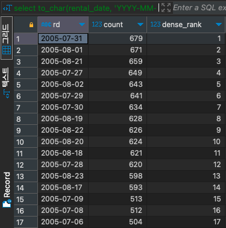

# DENSE_RANK

#SQL #SQLD #window-function 

순위를 매기면서 같은 순위가 존재하더라도 다음 순위를 건너뛰지 않고 이어서 매긴다.

- ex) 1, 2, 2, 3, 4, 5, 6, 7, 7, 7, 8, ...

```SQL
select to_char(rental_date, 'YYYY-MM-DD') as RD,
	   count(*),
	   DENSE_RANK() over(order by COUNT(*) desc) as DENSE_RANK
from rental r
group by RD
order by DENSE_RANK;
```


