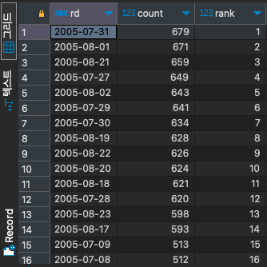

# RANK

#SQL #SQLD #window-function 

순위를 매기면서 같은 순위가 존재하는 수 만큼 다음 순위를 건너뛴다.

- ex) 1, 2, 2, 4, 5, 6, 7, 7, 7, 10, 11, ...

```SQL
select to_char(rental_date, 'YYYY-MM-DD') as RD,
	   count(*),
	   RANK() over(order by COUNT(*) desc) as RANK
from rental r
group by RD
order by RANK;
```


