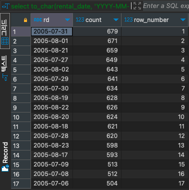

# ROW_NUMBER

#SQL #SQLD #window-function 

순위를 매기면서 동일한 값이라도 각기 다른 순위를 부여한다.

- ex) 1, 2, 3, 4, 5, 6, 7, 8, ...
- 2와 3이 동일한 값이더라도, 정렬 순서에 따라 다른 순위가 부여된다.

```SQL
select to_char(rental_date, 'YYYY-MM-DD') as RD,
	   count(*),
	   ROW_NUMBER() over(order by COUNT(*) desc) as ROW_NUMBER
from rental r
group by RD
order by ROW_NUMBER;
```


