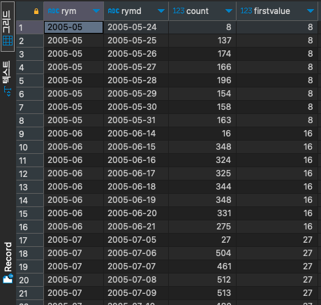

# FIRST_VALUE

#SQLD #SQL #window-function 

파티션 별 가장 선두에 위치한 데이터를 구하는 함수이다.

```SQL
select to_char(rental_date, 'YYYY-MM') as RYM,
	   to_char(rental_date, 'YYYY-MM-DD') as RYMD,
	   count(*),
	   FIRST_VALUE(count(*)) over (
	   								partition by to_char(rental_date, 'YYYY-MM')
	   								order by to_char(rental_date, 'YYYY-MM-DD')
	   							  ) as firstvalue
from rental r
group by RYMD, RYM;
```


