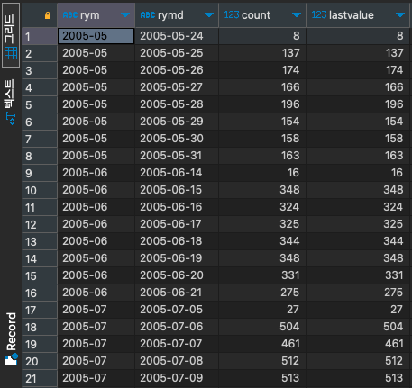
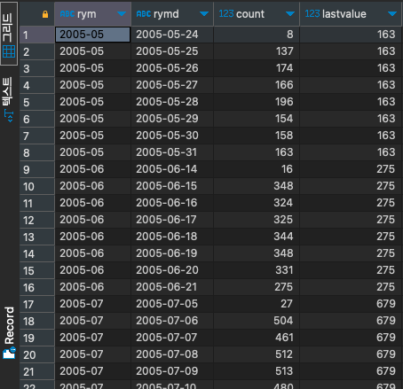

# LAST_VALUE

#SQLD #SQL #window-function 

파티션 별 가장 끝에 위치한 데이터를 구하는 함수이다.

```SQL
select to_char(rental_date, 'YYYY-MM') as RYM,
	   to_char(rental_date, 'YYYY-MM-DD') as RYMD,
	   count(*),
	   LAST_VALUE(count(*)) over (
	   								partition by to_char(rental_date, 'YYYY-MM')
	   								order by to_char(rental_date, 'YYYY-MM-DD')
	   							 ) as Lastvalue
from rental r
group by RYMD, RYM;
```

- `ORDER BY` 절 뒤에 범위가 명시 되지 않아, 기본 범위인 `RANGE UNBOUNDED PRECEDING`를 이용해 첫 행부터 현재 행까지 중 마지막 값을 이용해 출력을 진행한다.



```SQL
select to_char(rental_date, 'YYYY-MM') as RYM,
	   to_char(rental_date, 'YYYY-MM-DD') as RYMD,
	   count(*),
	   LAST_VALUE(count(*)) over (
	   								partition by to_char(rental_date, 'YYYY-MM')
	   								order by to_char(rental_date, 'YYYY-MM-DD')
	   								range between unbounded preceding and unbounded following 
	   							 ) as Lastvalue
from rental r
group by RYMD, RYM;
```

- 범위를 특정해서 해당 범위의 마지막 값을 출력하도록 했다.


