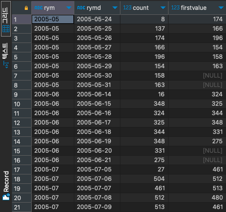

# LEAD

#SQL #SQLD #window-function 

파티션 별 특정 수만큼 뒤에 있는 데이터를 구하는 함수이다.

LEAD 함수의 두 번째 인자값을 생략하면, 기본 값은 1이다.

```SQL
select to_char(rental_date, 'YYYY-MM') as RYM,
	   to_char(rental_date, 'YYYY-MM-DD') as RYMD,
	   count(*),
	   LEAD(count(*), 2) over (
	   								partition by to_char(rental_date, 'YYYY-MM')
	   								order by to_char(rental_date, 'YYYY-MM-DD')
	   							  ) as firstvalue
from rental r
group by RYMD, RYM;
```


